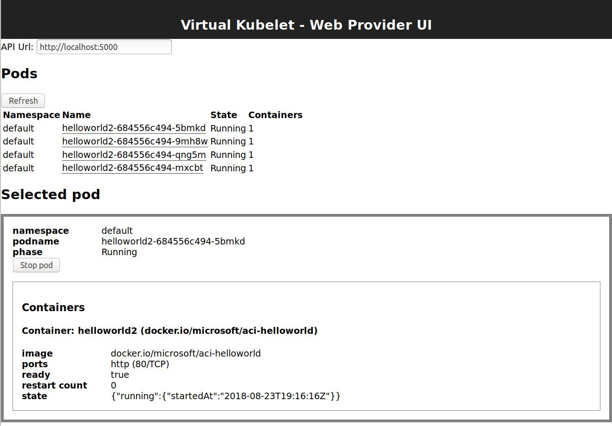

# Virtual Kubelet Web UI
This project is a sample Web UI over  APIs for the [Virtual Kubelet](https://github.com/virtual-kubelet/virtual-kubelet) web provider.


```
                                                                  +------------------------------+
                                                                  |                              |
                                                                  | VK Web UI (this project)     |
                                                                  |                              |
                                                                  +-------------+----------------+
                                                                                |
                                                                                | HTTP
                                                                                |
+----------------+         +---------------------------+          +-------------v----------------+
|                |         |                           |   HTTP   |                              |
|   Kubernetes   | <-----> |   Virtual Kubelet: Web    | <------> |   Web provier API            |
|                |         |                           |          |                              |
+----------------+         +---------------------------+          +------------------------------+
```



TODO - instructions for building/running